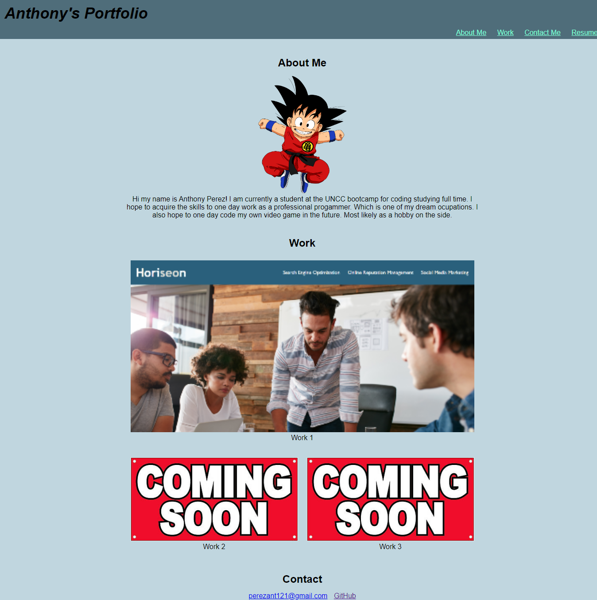

# Portfolio
## Table of Contents

* [Description](#description)
* [Visuals](#visuals)
* [Link](#link-to-site)

## Description
02-html-git-css

I created a web page starting from scratch to display my past works and link my resume. As well as provided ways to contact me at the bottom of the page. 

## Visuals

## Link to Site
[Link to live site](https://supernaldeity.github.io/Portfolio/)